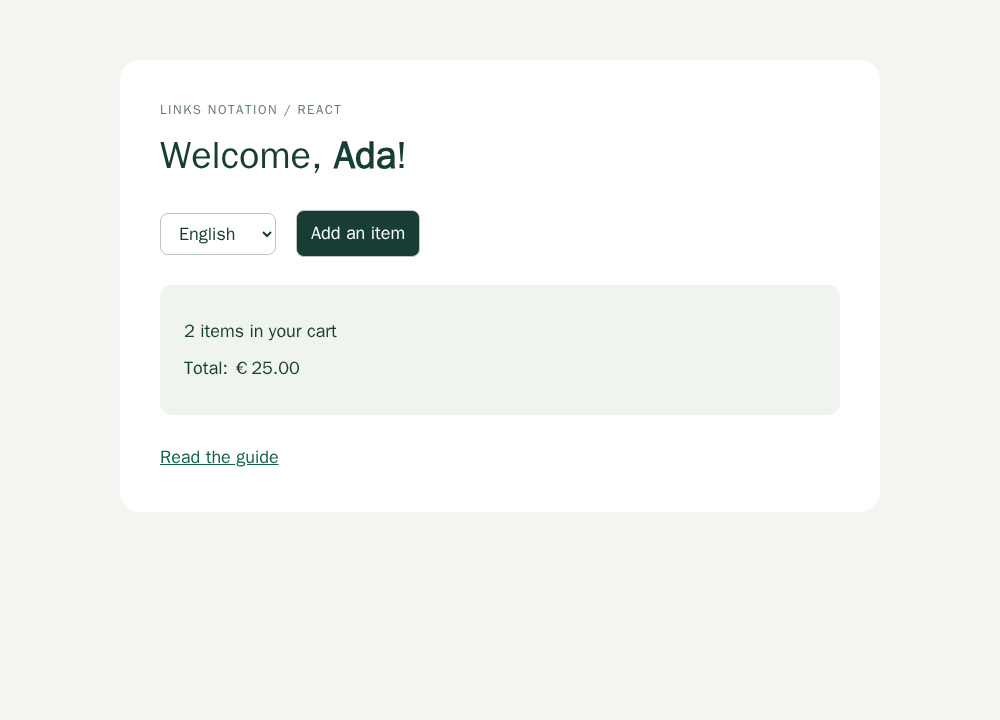

# Issue 25: GT capabilities over Links Notation

[Issue 25](https://github.com/link-foundation/lino-i18n/issues/25) requests full
React support, a similarly simple code-only API, comparison with General
Translation (GT), collected evidence, and a plan covering every requirement in
one pull request. [PR 28](https://github.com/link-foundation/lino-i18n/pull/28)
implements source messages, rich React translation, optional ICU in Rust,
request isolation, typed dictionaries, locale configuration, a JSX compiler,
Next App Router and Vue/SFC integration, optional GT SDK services and bounded module-aware
extraction/translation workflows.

**This is substantial runtime and tooling coverage, not complete feature parity
with the entire GT monorepo.** GT also includes hosted services, framework
packages, CMS integrations and development tools. The
[requirement matrix](REQUIREMENTS.md) explicitly records those gaps and their
solution plans. It must remain part of the acceptance review; a working React
example alone does not satisfy the issue's unrestricted title.

## Research boundary and evidence

The upstream repository was inspected on 2026-10-08 at commit
`fb7584f5548b7454a7c95827de459c684f659d5b`. Package manifests, public entrypoints,
derivation implementations, locale configuration, the issue and recent related
pull requests are stored under [data](data/README.md). The snapshot records
SHA-256 checksums, making later upstream changes distinguishable from this study.
Upstream files retain their MIT license in `data/gt-LICENSE.txt`.

The previous contents of this directory described hive-mind template work,
including unrelated issues 1274 and 1278. They are preserved without editing in
[template-background](template-background/README.md); they are not evidence for
this i18n issue.

Primary online sources used alongside the saved code:

- [GT repository and package README](https://github.com/generaltranslation/gt/tree/fb7584f5548b7454a7c95827de459c684f659d5b): package inventory and architecture.
- [GT React introduction](https://generaltranslation.com/docs/react/introduction) and [T component](https://generaltranslation.com/docs/react/api/components/t): source JSX authoring and runtime expectations.
- [GT React 10.15.0 release](https://generaltranslation.com/en-GB/blog/gt-react_v10_15_0): derivation and tagged-template authoring.
- [GT JSX attribute localization change](https://github.com/generaltranslation/gt/pull/2382): configurable attributes are a compiler capability, not just JSX child translation.
- [FormatJS IntlMessageFormat documentation](https://formatjs.github.io/docs/intl-messageformat/) and [Rust ICU MessageFormat](https://formatjs.github.io/docs/rust/icu-messageformat/): existing parser/runtime capabilities.
- [Babel parser](https://babeljs.io/docs/babel-parser) and [traverse](https://babeljs.io/docs/babel-traverse): parse real JS/TS/JSX and resolve lexical bindings rather than matching source strings.
- [React use-client reference](https://react.dev/reference/rsc/use-client): explicit separation of client-hook and server-only exports.

Documentation pages are mutable; the pinned source files take precedence for
claims about this particular snapshot. Recent local React/browser PRs and recent
upstream PR metadata are saved with the issue. No issue comments existed when
collected. No screenshots were attached to the issue.

## Root causes of the capability gap

The existing runtime translated catalog keys and handled suffix-based plurals.
The React adapter added context, keyed `Trans`, selectors and Intl components,
but did not translate source JSX or enumerate all possible branch content.
Code-only consumers had no deferred source descriptor, full ICU formatting,
tagged-template translation or extraction pipeline. A regex-based extractor
would also mistake unrelated calls, comments and shadowed bindings for messages.

The catalog reader treated keys as unquoted tokens, so a source sentence could
not serve as a key. Nested formatting used plain objects; special property names
such as `__proto__` could disappear rather than survive a round trip. These were
format/runtime defects independent of React. Both were reproduced before fixes.

The compiled React Intl converter reconstructed only part of the ICU AST. It
could silently drop select branches or formatting details. Reusing the FormatJS
AST printer fixes the actual conversion loss instead of expanding a partial
printer branch by branch.

A further boundary is request state: a global translator would let one request's
locale change affect another request and produce hydration mismatches. Server
helpers now create an instance per request and client snapshots carry matching
catalog state. Loaders also need deduplication, failure retry and ordering guards
so a slow previous locale selection cannot overwrite the latest selection.

## Implementation choices and alternatives

| Area                 | Alternatives considered                                                       | Chosen approach and reason                                                                                                                                                |
| -------------------- | ----------------------------------------------------------------------------- | ------------------------------------------------------------------------------------------------------------------------------------------------------------------------- |
| JS ICU               | Hand-written parser; ICU subset; FormatJS runtime                             | `intl-messageformat` and its parser/printer preserve nested ICU, skeletons and quotes with maintained implementations.                                                    |
| Rust ICU             | Reimplement ICU; require new Rust for all users; optional engine              | Optional `formatjs_icu_messageformat` feature. Default Rust 1.87 remains supported; ICU needs 1.92.                                                                       |
| Extraction           | Regex; TypeScript-only compiler; Babel AST                                    | Babel handles JS/TS/JSX, import aliases and lexical scope with no application execution.                                                                                  |
| JSX restoration      | HTML-string injection; translation-generated props; code-owned elements       | ICU tags restore only original elements and props. Arbitrary dynamic values are named opaque placeholders.                                                                |
| Derivation           | Execute application functions; unlimited enumeration; bounded static analysis | Enumerate local/imported static returns/dictionaries/conditionals; fail with diagnostics at 100 variants or 20 levels.                                                    |
| Framework state      | Global mutable singleton; per-request explicit instance                       | Explicit instances and JSON snapshots make concurrency and hydration testable without framework dependencies.                                                             |
| Translation services | Embed one vendor SDK; use a provider interface                                | Providers return validated candidates; approved entries are preserved and catalog format stays portable.                                                                  |
| Compiler integration | Regex wrapping; unbounded evaluation; AST transformation                      | Opt-in Babel transform wraps JSX text/variables and configured attributes, retains source maps and explicit boundaries, and emits matching manifests through Vite/Rollup. |
| Native browser       | Add npm imports to the browser entry; optional bundled features               | Native browser API remains dependency-free; source ICU and React use separate bundled entries.                                                                            |

Known alternatives include GT itself for its hosted/framework workflows,
FormatJS/react-intl for ICU and React formatting, and i18next for keyed catalogs,
plugins and middleware. Replacing lino-i18n with one of them would lose its
Links Notation storage contract. The implementation instead reuses parsing and
formatting components while keeping catalogs, old APIs and release workflows.
No service provider is selected on behalf of applications.

## Public workflow

1. Author `gt`, `msg`, `T`, `Var`, `Plural`, `Branch` or finite `derive` messages.
2. Extract static sources into `messages.json` and `en.lino` using the CLI or
   Vite/Rollup plugin. Diagnostics stop unsupported extraction.
3. Translate locally or call a provider to write candidate `.lino` catalogs.
4. Validate ICU, placeholders, tags and missing/unused messages. Compare a
   previous manifest to review source changes under stable ids.
5. Load approved catalogs inline or through versioned loaders/cache adapters.
6. Render with per-app/per-request instances; hydrate from the same snapshot.

The [source-message guide](../../source-messages.md) documents actual signatures,
examples and limits. The [framework guide](../../framework-integrations.md)
documents the tested Next adapter and remaining ecosystem boundaries. The branch supplies minor release fragments for both JS and Rust.

## Reproduction and verification

The added tests were first run against the old exports and failed because
source runtime/tooling/server APIs were missing. Specific regressions were then
reproduced for quoted source keys in JS/Rust, complete compiled ICU conversion,
prototype-like keys, explicit-id derivation consistency and CLI stale-source
review. Fixes made those tests pass; adding exports alone was insufficient.

| Behavior                                                                        | Automated evidence                                                             |
| ------------------------------------------------------------------------------- | ------------------------------------------------------------------------------ |
| Source/descriptors/templates, ICU select/ordinal/offset/skeletons               | `js/tests/messages.test.js`                                                    |
| Loader deduplication, retry, latest-switch ordering, versions/cache/snapshots   | `js/tests/messages.test.js`                                                    |
| JSX restoration, safe dynamic values, branches and server content               | `js/tests/react-content.test.js`, `js/tests/server.test.js`                    |
| Snapshot hydration and catalog/region updates                                   | `js/tests/react.test.js`                                                       |
| Finite function/dictionary/JSX derivation; cycles and unsupported expressions   | `js/tests/derivation.test.js`                                                  |
| Aliases, shadowing, descriptors, JSX structure, ICU catalog/provider validation | `js/tests/tooling.test.js`                                                     |
| CLI extraction/provider/check and real Rollup build                             | `js/tests/tooling-integration.test.js`, `js/experiments/rollup-extraction.mjs` |
| Quoted and prototype-like catalog keys                                          | `js/tests/source-keys.test.js`, Rust integration tests                         |
| Full ICU AST conversion                                                         | `js/tests/icu-conversion.test.js`                                              |
| Native browser loading and locale controls                                      | Existing Playwright browser suite                                              |
| New public declarations                                                         | `js/tests/types/messages.tsx`                                                  |
| Rust source/deferred/optional ICU                                               | `rust/lino-i18n/tests/messages.rs`                                             |

Local verification runs Node, Bun, Deno, TypeScript, Chromium browser tests,
ESLint/Prettier/duplication/secrets checks, npm audit, Cargo tests with all
features, Cargo default-feature MSRV tests, rustfmt and Clippy. CI runs the JS
runtime/OS matrix and the existing release/workflow checks; the Rust workflow
adds all-feature tests plus a default-feature Rust 1.87 test. Process test
timeouts are finite and static derivation limits prevent unbounded expansion.
The [verification record](VERIFICATION.md) records commands and outcomes.

## Visual verification

The React example was opened in Chromium and switched from English to French.
The screenshots preserve both rendered locales at 1000 × 720. Automated browser
checks and React tests cover the relevant controls; this is a feature demo, not
a before/after screenshot of a reported visual defect.

## Acceptance limits

The optional Next App Router adapter, JSX compiler and published GT SDK bridge
are implemented and tested, as are Vue/SFC, Python extraction and Native Text
adapters. Dedicated TanStack/Sanity integrations, a replacement GT project/CDN
backend, editor UI and replay tooling remain outstanding. The matrix supplies concrete solutions and
validation plans for them. They cannot be called complete because a generic
provider or a framework recipe exists. The issue's request for entire-monorepo
parity remains broader than the implementation, and PR 28 should report that
boundary rather than automatically close the issue.

## Python and Markdown integration findings

Published `@generaltranslation/python-extractor` 0.2.60 reproduces a false
translation call inside `def unrelated(t)` and silently returns no errors for
`from gt_flask import t; t("bad"` with an unclosed call. The finite probe is kept
in `js/experiments/gt-python-contract.mjs` (install that optional upstream package
to rerun). Our Python extraction uses the standard-library AST with explicit
lexical binding and syntax checks, and writes the shared manifest without
executing source. Imported helper resolution and GT-specific context encodings
remain explicit gaps rather than speculative equivalence.

`gt-remark` 1.0.12 exports text escaping, GFM and CJK helpers, rather than a
message-extraction API. The optional entry reuses these implementations. Actual
MDX parse/stringify/reparse found that remark-stringify escapes the ampersands
in the helper's generated character references. `preserveEscapedEntities` adds
a serializer extension so readers recover literal punctuation without affecting
code or expression nodes. The supported-locale adapter similarly reuses registry
2.1.41, with regional matches preserved; its 133 service locales do not imply
available local catalogs. See [usage and limits](../../ecosystem-tools.md).
