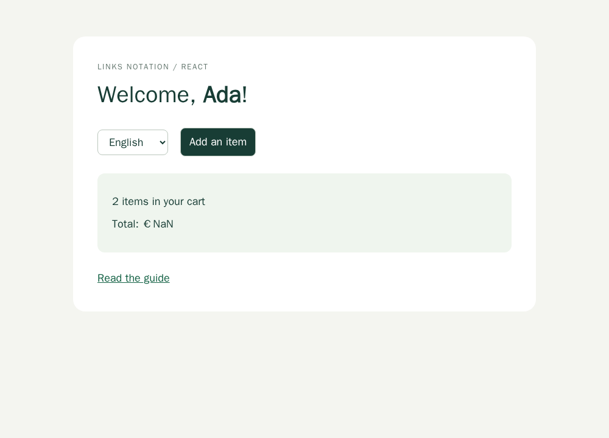
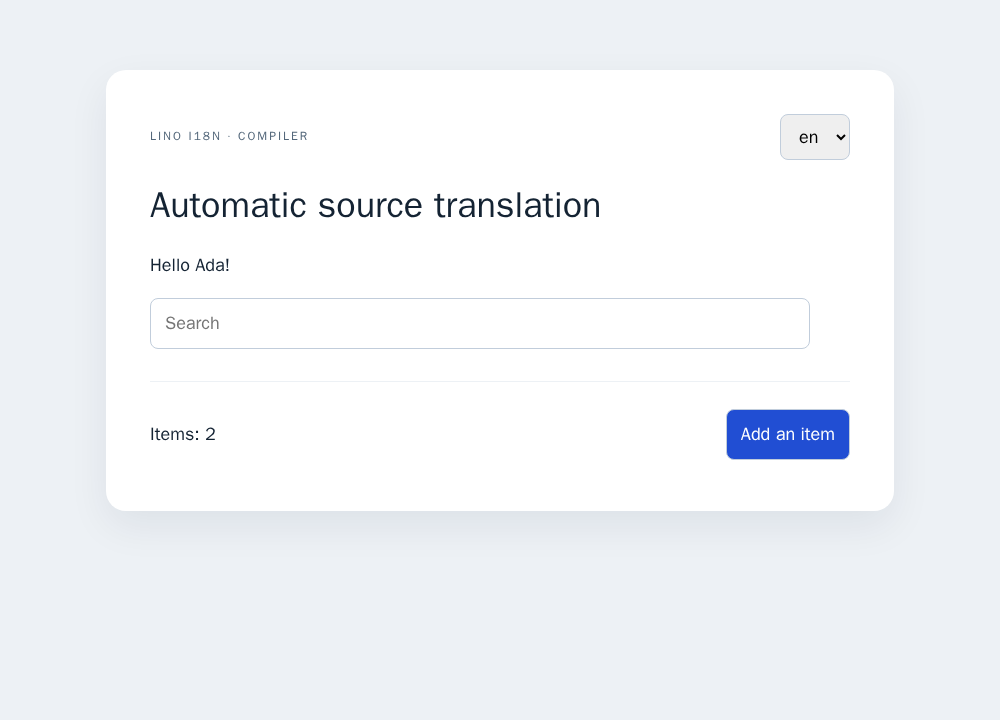
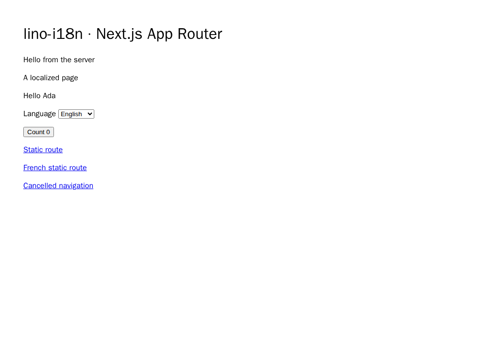
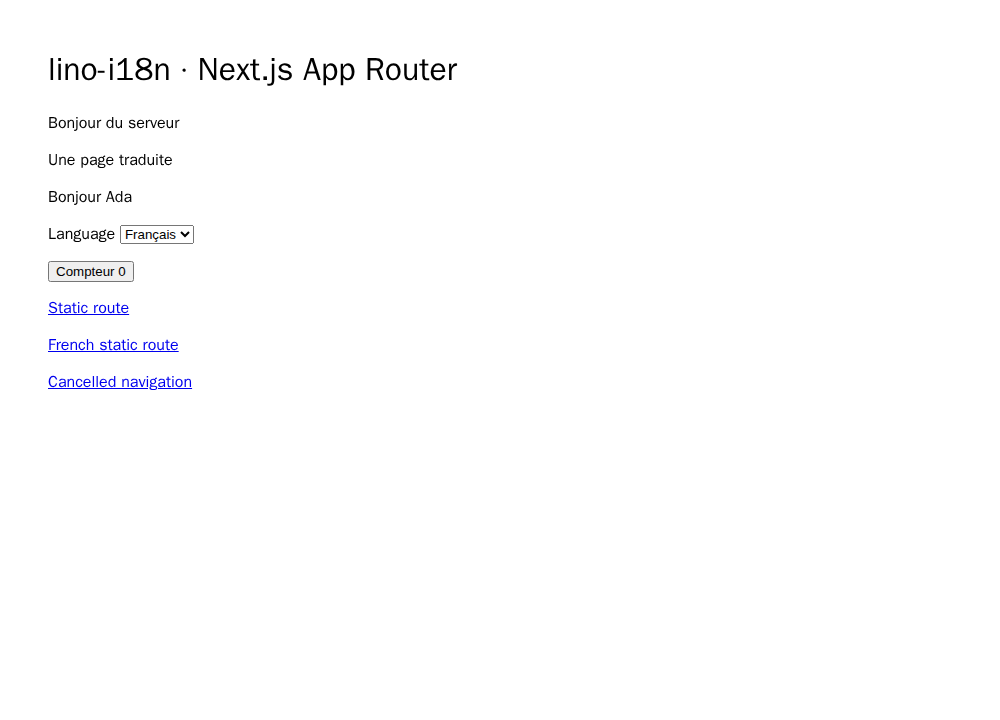
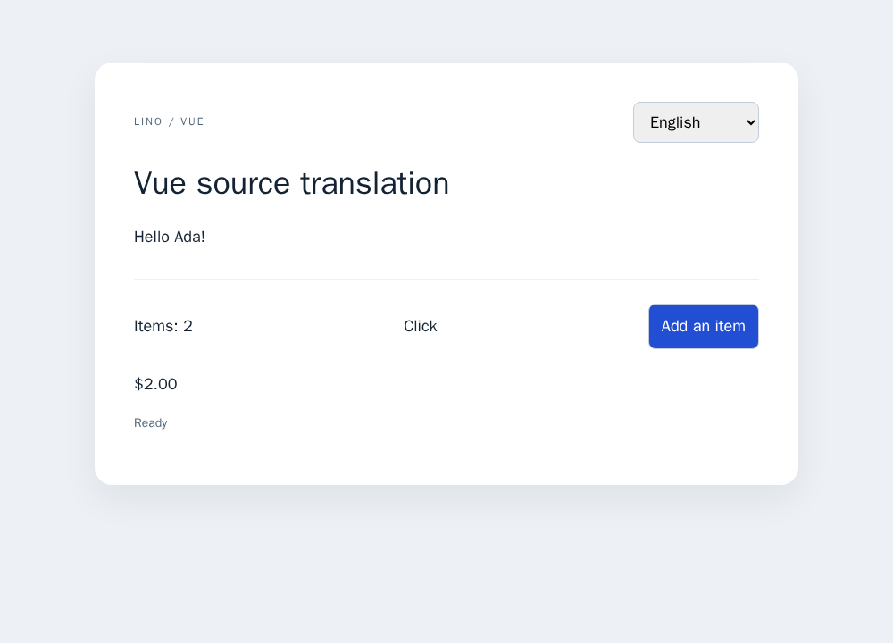
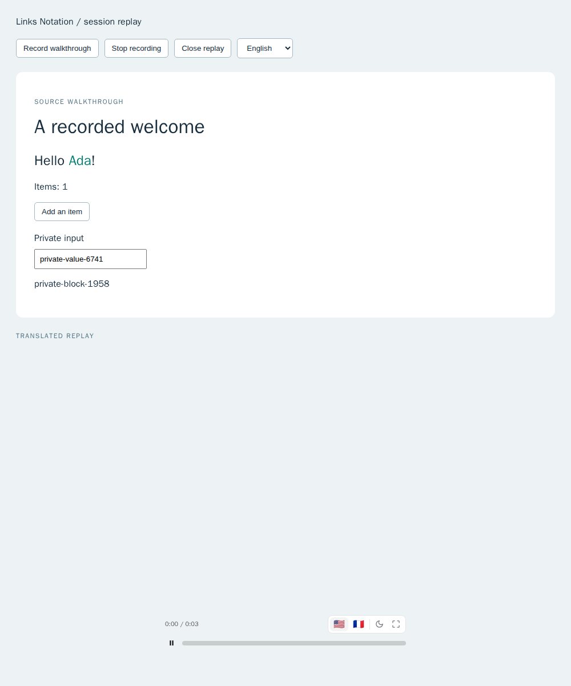
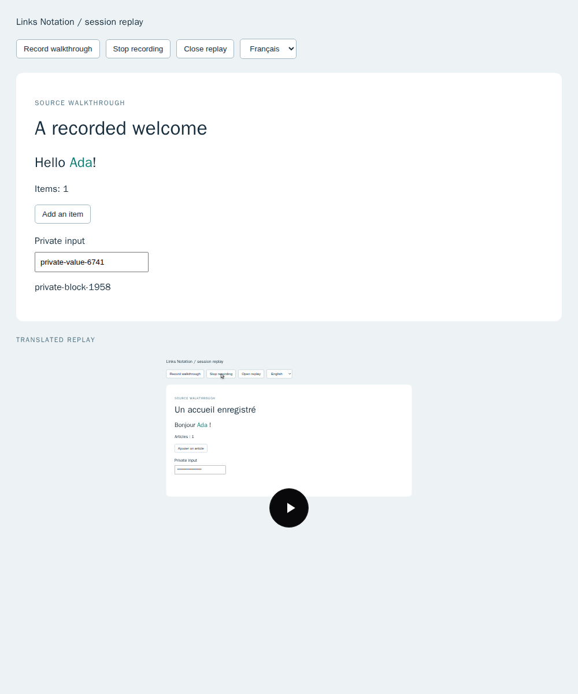

# Verification record

Verification was performed on 2026-10-08 in the prepared issue branch. Logs are
kept locally in the ignored `ci-logs/` directory. The tests and experiment scripts
are versioned, so results can be reproduced without depending on local logs.
See PR 28's checks for the final pushed revision and platform matrix.

## Before implementation

| Reproduction                                                   | Observed failure                                                                                        | Regression coverage                                                 |
| -------------------------------------------------------------- | ------------------------------------------------------------------------------------------------------- | ------------------------------------------------------------------- |
| Import the source runtime and render rich source content       | `ERR_MODULE_NOT_FOUND` for `js/src/messages.js`; source APIs did not exist.                             | `messages.test.js`, `react-content.test.js`                         |
| Extract source and request-isolated server messages            | Source/tooling/server exports were absent.                                                              | `tooling.test.js`, `server.test.js`                                 |
| Format and reload quoted sentence keys                         | JS lost source keys; Rust failed with `locale root break cannot have a direct value` for a newline key. | `source-keys.test.js`, Rust `tests/messages.rs`                     |
| Convert compiled ICU select, quoted literal and skeletons      | Converter produced `{literal} {gender} {price}`; formatting threw `MISSING_VALUE` for `literal`.        | `icu-conversion.test.js`                                            |
| Round-trip `__proto__` as a catalog key                        | JavaScript result omitted the own property.                                                             | `source-keys.test.js`                                               |
| Pass an explicit id in a source call                           | Returned `Welcome` instead of catalog value `Bienvenue`.                                                | `messages.test.js`                                                  |
| Compare old/new stable-id source manifests                     | CLI returned success despite changed source requiring review.                                           | `tooling-integration.test.js`                                       |
| Extract the `m` tagged alias and boolean/comment-only JSX      | Extraction omitted `m` and produced `falseHello <c0></c0>` instead of runtime identities.               | `tooling.test.js`                                                   |
| Derive one JSX variant with an explicit id                     | Extractor accepted an id inconsistent with source-variant identities.                                   | `derivation.test.js`                                                |
| Derive a boolean JSX child                                     | Extracted `Hello false` where React renders `Hello `.                                                   | `derivation.test.js`                                                |
| Follow inherited case-study links after moving their files     | Three links target missing files.                                                                       | `experiments/issue-25-ci-regressions.py`                            |
| Run PR checks with the release preflight intentionally skipped | Changeset, changelog, browser and CLI jobs skip despite detected code changes.                          | Workflow policy and `experiments/issue-25-ci-regressions.py`        |
| Pass a currency value as React children with a locale override | The component displayed `NaN` in the provider locale instead of `$2.00`.                                | `react.test.js`, browser React example and before/after screenshots |

## Local checks

Run JavaScript commands from `js/` and other commands from the repository root.

| Command                                                                                                              | Result                                                                                                                                                                                        |
| -------------------------------------------------------------------------------------------------------------------- | --------------------------------------------------------------------------------------------------------------------------------------------------------------------------------------------- |
| `npm test`                                                                                                           | 187 tests pass with a 30-second per-test timeout.                                                                                                                                             |
| `bun test --timeout 30000`                                                                                           | 187 tests pass.                                                                                                                                                                               |
| `deno test --no-check --allow-read --allow-write --allow-env --allow-run`                                            | 187 tests pass. Node subprocesses run CLI/Rollup build integration fixtures.                                                                                                                  |
| `npm run test:types`                                                                                                 | Five strict configurations compile core, Vue, Next, Native, Start, replay and lint positive/negative API usage.                                                          |
| `npm run test:browser`                                                                                               | Nine Chromium tests pass, covering native browser, React, compiler, Vue, Native Text and replay.                                                                                     |
| `npm run build:next` and `LINO_NEXT_PRODUCTION=1 npm run test:next`                                                  | Production Next 16.4.0 build generates both locale static pages; four Chromium tests cover hydration, request/cache isolation, cookies, navigation, metadata and document language/direction. |
| `node experiments/gt-sdk-contract.mjs`                                                                               | Published GT 9.5.5 SDK sends real HTTP runtime, upload and versioned-download contracts to an isolated loopback fixture.                                                                      |
| `npm run check`                                                                                                      | ESLint, Prettier and duplication checks pass.                                                                                                                                                 |
| `npm run lint:secrets`                                                                                               | Pass.                                                                                                                                                                                         |
| `npm audit --package-lock-only --audit-level=high`                                                                   | Zero vulnerabilities reported.                                                                                                                                                                |
| `bash scripts/check-mjs-syntax.sh`                                                                                   | Pass.                                                                                                                                                                                         |
| `node examples/source-messages.mjs`                                                                                  | Source/deferred/context/derived example runs.                                                                                                                                                 |
| `node experiments/currency-props.mjs`                                                                                | Generates before/after browser fixtures using the archived adapter and current adapter with identical source children.                                                                        |
| `node bin/lino-i18n.js extract --in examples/source-messages.mjs --out ../ci-logs/example-catalogs`                  | Example sources extract without executing application code.                                                                                                                                   |
| `cargo test --locked --manifest-path rust/Cargo.toml --workspace --all-features`                                     | Pass, including optional ICU and doctests.                                                                                                                                                    |
| `cargo +1.87.0 test --locked --manifest-path rust/Cargo.toml --workspace --all-targets`                              | Default-feature MSRV tests pass.                                                                                                                                                              |
| `cargo fmt --manifest-path rust/Cargo.toml --all -- --check`                                                         | Pass.                                                                                                                                                                                         |
| `cargo clippy --locked --manifest-path rust/Cargo.toml --workspace --all-targets --all-features -- -D warnings`      | Pass.                                                                                                                                                                                         |
| `node --test --test-timeout=30000 scripts/*.test.mjs`                                                                | 48 repository tooling tests pass.                                                                                                                                                             |
| `python3 scripts/check-docs.py`                                                                                      | Pass. Raw upstream HTML README is preserved as `.txt`.                                                                                                                                        |
| `python3 scripts/check-file-line-limits.py`                                                                          | Pass.                                                                                                                                                                                         |
| `python3 scripts/check-ci-policy.py`                                                                                 | Pass with pinned PyYAML installed.                                                                                                                                                            |
| `python3 scripts/check-dependency-pins.py`                                                                           | Pass with pinned PyYAML installed.                                                                                                                                                            |
| `python3 experiments/issue-26-dependency-pins.py`                                                                    | Pass; deliberate action/tool/MSRV/Node drift fixtures are rejected.                                                                                                                           |
| `python3 experiments/issue-23-shared-guards.py`                                                                      | Pass.                                                                                                                                                                                         |
| `python3 experiments/issue-25-ci-regressions.py`                                                                     | Three tests pass; before the fix, five subcases fail for moved links and implicit workflow status conditions.                                                                                 |
| `node js/scripts/build-docs-site.mjs` and `cargo doc --locked --manifest-path rust/Cargo.toml --workspace --no-deps` | Documentation builds pass.                                                                                                                                                                    |
| `python3 experiments/collect-issue-25.py`                                                                            | Pinned evidence recollection succeeds.                                                                                                                                                        |

The npm package dry-run is part of the automated test suite and checks that new
runtime exports and declarations ship while tests/build scripts stay excluded.
Screenshots were captured with Chromium through Playwright MCP, then the browser
and example server were closed. The optional ICU cache holds at most 100 compiled
messages; static derivation is bounded to 100 variants and 20 levels.

## CI investigation

The first pushed revision was `8fbe27cd6681acf31d8ebf60e6d9ff5e14608455`.
Runs created at `2026-10-08T18:37:16Z` were verified against that SHA; logs were
downloaded before making corrections.

- [Documentation run 37825695185](https://github.com/link-foundation/lino-i18n/actions/runs/37825695185):
  log lines 974–976 and 996–998 report three missing local case-study files
  referenced from `docs/BEST-PRACTICES.md`. Their links now include the preserved
  `template-background/` location.
- [JavaScript run 37825695215](https://github.com/link-foundation/lino-i18n/actions/runs/37825695215):
  log lines 526–531 confirm all code flags, including `any-code-changed=true`.
  The skipped checks were caused by GitHub's implicit `success()` job condition
  following an intentionally skipped release-preflight ancestor. The affected
  checks now use `!cancelled()` and require their immediate dependency to pass.
  Workflow policy rejects this accidental implicit gating, and the regression
  experiment runs in the workflow-policy job.

## Limits of the evidence

Next App Router is exercised with a production build and real browser/HTTP
requests. The published GT SDK is exercised against a loopback HTTP fixture,
including opaque ids and versioned uploads/downloads. No GT project id or API
key is configured, so live translation jobs, publication, billing and hosted
deployment remain unverified. TanStack/Native/Vue/Sanity and other ecosystem
requirements remain in the capability matrix; local checks do not establish
full ecosystem or hosted-service parity. Minor release fragments
prepare the existing release automation; no release was published directly.

## Currency visual regression

The children-based example against the adapter in commit `0d70b71` displays
`Total: €NaN`. The corrected adapter forwards children and locale overrides,
while retaining legacy value props and region subscriptions. The same example
then displays `Total: €25.00`. The browser regression checks English and French
totals; the unit regression also checks an explicit locale and zero value.

## Additional conformance regressions

| Reproduction                                                              | Before / after                                                                                                                                                                       | Regression coverage                                      |
| ------------------------------------------------------------------------- | ------------------------------------------------------------------------------------------------------------------------------------------------------------------------------------ | -------------------------------------------------------- |
| Use a custom Arabic catalog identity for keyed or server plural selection | Selected the wrong plural category; now uses the canonical locale without changing catalog identity.                                                                                 | `locale-config.test.js`, `react-server.test.js`          |
| Extract Node scoped helpers and async server factories                    | Sources were omitted; now follow the recognized imported APIs and await expressions.                                                                                                 | `tooling.test.js`                                        |
| Compile an automatic variable beside an explicit `auto0` variable         | Compiler names collided; automatic names now reserve existing explicit names.                                                                                                        | `compiler.test.js`                                       |
| Pass `__proto__` to the real GT SDK record input                          | SDK's ordinary-object conversion omitted the id; array input safely preserves it.                                                                                                    | `gt-provider.test.js`, `experiments/gt-sdk-contract.mjs` |
| Call Next `getTranslator()` and `getGT()` in one server render            | React's omitted/undefined argument keys created different instances; normalized keys share one instance.                                                                             | `tests/next-browser/app.pw.js`                           |
| Build a Next client entry with `export *`                                 | Next rejects wildcard exports at the client boundary; named exports build successfully.                                                                                              | Production Next fixture in CI                            |
| Prefetch a link targeting another locale                                  | Next strips prefetch headers before Proxy; background fetches now only forward the payload locale, and actual link navigation persists the preference while respecting cancellation. | `next.test.js` and `tests/next-browser/app.pw.js`        |
| Request an unknown asset path in the Next fixture                         | Filename became a locale and returned 500; route validation now returns 404.                                                                                                         | `tests/next-browser/app.pw.js`                           |
| Navigate Next locale pages without document language attributes           | `html.lang` was absent; the localized root layout supplies canonical language and direction, including static pages.                                                                 | `tests/next-browser/app.pw.js`                           |

Imported translator factories previously produced no extracted messages. The
module graph regression now follows named/default/namespace/barrel imports,
shared Next accessors, imported finite derivation and dictionaries, alias
resolution, cycles and ambiguous exports. The actual Next fixture extracts all
five authored source messages, excluding its generated `.next` bundles. The
Rollup experiment failed with one entry where four were required before graph
extraction, then passed after resolving its shared modules.

## Compiler and Next visual evidence

## Vue regressions and evidence

The absent Vue entry initially raised `ERR_MODULE_NOT_FOUND`. The optional adapter now passes actual Vue/compiler/server-renderer fixtures, isolated SSR and browser hydration. An ordinal bare-attribute test initially selected the cardinal fallback; marker serialization and component boolean props now select ordinal cases. Source-only initialization initially rejected without a catalog loader; source bootstrapping and switching no longer require a download. SFC extraction initially included an imported `T` under `v-pre`; its regression now preserves the literal native tag. Tests also verify import/slot/loop scope, UTF-16 offsets, finite template bounds and the CLI output.

## Python, Markdown and locale registry

The initial Python fixture failed because the optional entry did not exist.
Before implementation, the actual GT 0.2.60 probe collected `Must not extract`
through a shadowed parameter and accepted the unclosed `t("bad"` call with no
errors. The new regressions use real Python 3.14.7 parsing and assert that neither
behavior occurs. Fixtures also cover aliased/namespace calls, lexical class and
comprehension scopes, decoded literals/Unicode locations, bounded finite
cross-products, conflicting ids, runtime keyword values and shared CLI output.
The source example raises at top level yet extracts, proving code is not executed.

Actual unified Markdown/MDX round trips cover every GT helper category. Before
`preserveEscapedEntities`, the reparsed JSX text contained literal `&#42;` and
`&#123;`; after the extension it recovers `*` and `{` as text, retaining outside
Markdown emphasis, code and expressions. Registry tests use the real 2.1.41
package (133 locales), preserving script/region matches and independent lists.
Twelve affected tests pass in Node, Bun and Deno. The complete Node suite has
159 tests, with strict positive/negative TypeScript API fixtures.

The first cross-platform CI run for `5ada2e9` failed only on Windows in all
three runtimes: expected Unicode column 6, received 9 (downloaded JavaScript
run 37846323232, lines 5167–5176, 5699 and 9717). Python's piped stdin inherited
the platform encoding. The parser now explicitly reconfigures stdin to UTF-8.
`js/experiments/python-encoding.mjs` reproduces a cp1252 pipe locally and verifies
both the column and a Chinese literal. The automated regression covers that
encoding regardless of the host OS.

## Native text adapter

Eight runtime regressions use actual React Native Web 0.21.4; two Chromium
scenarios cover translated native Text, preserved nested styles/presses, zero
currency, storage reload and failed catalog loads. The complete Node suite has
168 tests; the complete ordinary browser suite has eight scenarios. Strict types
retain injected Text props. A separate optional probe compiled actual React
Native 0.87.1 with platform globals isolated; upstream generated declarations
required skipLibCheck there only. The CI type suite uses no skipLibCheck. Native
Metro dependencies were removed after that probe, keeping the default install's
audit clear. Device/emulator and older Hermes Intl behavior were unavailable.

MCP opened the example, selected French, verified persisted `fr`, saved both
1000 × 720 screenshots and closed the browser.

All five workflows for the Windows encoding fix `26c5172` completed successfully
(runs 37847797680, 37847797682, 37847797708, 37847797796 and 37847797875,
created 2026-10-08 21:35 UTC). The Native extraction barrel regression first
failed with an unresolved Text diagnostic; module resolution now preserves
external native Text metadata. Eight affected tests pass in Bun and Deno as well.

The Native commit's JavaScript run 37849032057 (2026-10-08 21:45 UTC,
`afb0853`) failed only on macOS/Bun: `ReferenceError: ShadowRoot is not defined`
at downloaded log line 8717. Bun shares test-file globals; the React fixture
installed an incomplete DOM and left its closed window in place. A child-process
regression reproduced the exact stylesheet import failure before the fix. The
shared DOM fixture now supplies ShadowRoot and restores every original global
descriptor on disposal. Complete Node/Bun suites and the affected Deno suite
pass, including the import and restoration regression.

## TanStack Start

Start 1.168.60/Router 1.170.41 are exercised through the real Vite plugin and
production Web server. Four unit regressions cover request overlap, nested
failures, source bootstrap, snapshot preloading and factory/hook extraction.
The core request regression preserves keyed catalog loading without an explicit
source locale. Strict types use actual middleware and Link declarations.

The first browser run reproduced a browser import of `node:async_hooks`; the
fixture now initializes its server adapter behind Start's server-only boundary.
A production run then exposed missing static scripts; srvx resolves its static
directory against the server entry. The corrected `../client` path serves the
built assets. Both production Chromium scenarios pass with SSR French, hydration,
preserved component count, query/hash navigation, ambient server functions,
cookies, preloading and cancelled clicks. CI builds and tests that production
fixture. MCP verified lang/cookie/heading in both locales, recorded no console
errors, saved the two screenshots and closed the browser/server.

All five workflows for Start commit `b7b21c5` completed successfully, created
2026-10-08 22:06 UTC: runs 37851328231, 37851328316, 37851328242,
37851328289 and 37851328233.

## Replay catalog and browser conformance

The initial test failed on the absent replay entry. The actual published
`gt-rrweb` 0.2.0 harvester then reproduced a variable fallback defect: the recorded
`{name}` value `Ada` became `Adele` through a separate catalog key. Our automated
comparison verifies that defect and protects all text nodes beneath a marked
message from bare-string lookup. ICU conversion checks ordered variable identity,
branch ambiguity, rich literal boundaries, locale-root selection, prototype-like
keys and finite byte/node/depth budgets without running application code.

The initial rich fixture retained separate nodes, but plain ICU variables could
merge into a single React text node. Replay `T` now wraps simple variables while
retaining code-owned rich elements, matching the recorded leaf structure. Missing
variables still raise the original formatting error. Actual Chromium capture and
playback verifies French headings/rich text, count mutations, unchanged `Ada`,
masked input values, omitted blocked text, locale switching and teardown. The
bundle's custom overlay event is updated along with its overlay table.

The first manual screenshot exposed a collapsed unsized player container; the
example now supplies a definite height and the browser test requires a visible
frame. MCP verified the rendered French count and heading, saved source/French
1000 × 1201 screenshots, and closed the browser and server. This records the
published player; it does not establish GT hosted-service or arbitrary replay
message parity.

## Optional lint diagnostics

The initial test failed because no lint export existed. Actual ESLint tests now
cover source calls, aliases, namespaces, translator factories, shadowed imports,
valid descriptors/finite derivation, ICU syntax, source JSX and headless Branch
attributes. The three rules share the existing Babel extractor and cached
analysis. Finite source-byte and AST budgets are checked before the additional
Babel parse; the configured ESLint parser still runs first.

A direct identifier can be wrapped in an explicitly named Var through an editor
suggestion. Re-linting the suggested result verifies valid extraction, a single
value occurrence, collision avoidance and preservation of the use-client
directive. There is no automatic concatenation or branch rewrite because GT's
JSX contract differs. The optional plugin has strict actual ESLint type coverage.

All five workflows for replay commit `65e14dc` passed, created 2026-10-08
22:26 UTC: runs 37853477128, 37853477068, 37853477113, 37853477058
and 37853477084. Acceptance requires checking the final pushed SHA.

Local lint validation: 187 Node tests, eight affected Bun tests, eight affected
Deno tests, all five strict type configurations, nine Chromium tests, the runnable
ESLint example, lint/format/duplication, secrets, docs and policy/pin checks pass.
The installed development dependency graph has zero reported npm vulnerabilities.
The final suggestion test also prevents shadowing an existing global identifier.

## Sanity contract and upstream limits

The absent Sanity entry first reproduced `ERR_MODULE_NOT_FOUND`. Actual GT
4.0.24 decoding then regenerated the Portable Text span key instead of `span1`;
the document import regression now preserves that key and its strong mark. A
second regression returned a title-only plan when the target's block array was
empty, silently losing the translated block. The bridge now rejects missing
target array keys before calling GT's merger. Tests also preserve excluded
localized fields, immutable inputs and target metadata, reject stale revisions
and markup/field injection, and verify a real Sanity client's `ifRevisionID`
patch against a loopback HTTP server.

The isolated `js/examples/sanity-usage` consumer tests the installed local package,
actual Sanity/schema 6.18.0 and the published serializer/merger exports. Its
seven runtime tests and positive/negative consumer type checks run in the
existing Chromium CI job. Studio declarations require `skipLibCheck` after
actual upstream GROQ, QuickLRU and type-import errors;
[saved diagnostics](data/sanity-type-errors.txt) record that limit. Core's five
type configurations retain strict library checks.

A fresh audit reported 19 upstream Studio/CLI advisories (nine high, ten
moderate); the [saved advisory report](data/sanity-advisories.json) includes
their exact links and affected ranges. Published braces 3.0.3 and sprintf-js
1.1.3 remain the registry maxima and have no compatible patched release in
this graph. Core's separate clean install/audit reports zero vulnerabilities.
The optional graph's advisories are unresolved; isolation does not repair them.
No authenticated Studio, hosted translation or document publication was tested.

See [Sanity usage and bounds](../../sanity.md), including the 1,000-item array
limit that bounds the upstream keyed merger. The requirement matrix retains
hosted service, deployment, Python runtime and agent/daemon acceptance limits.
