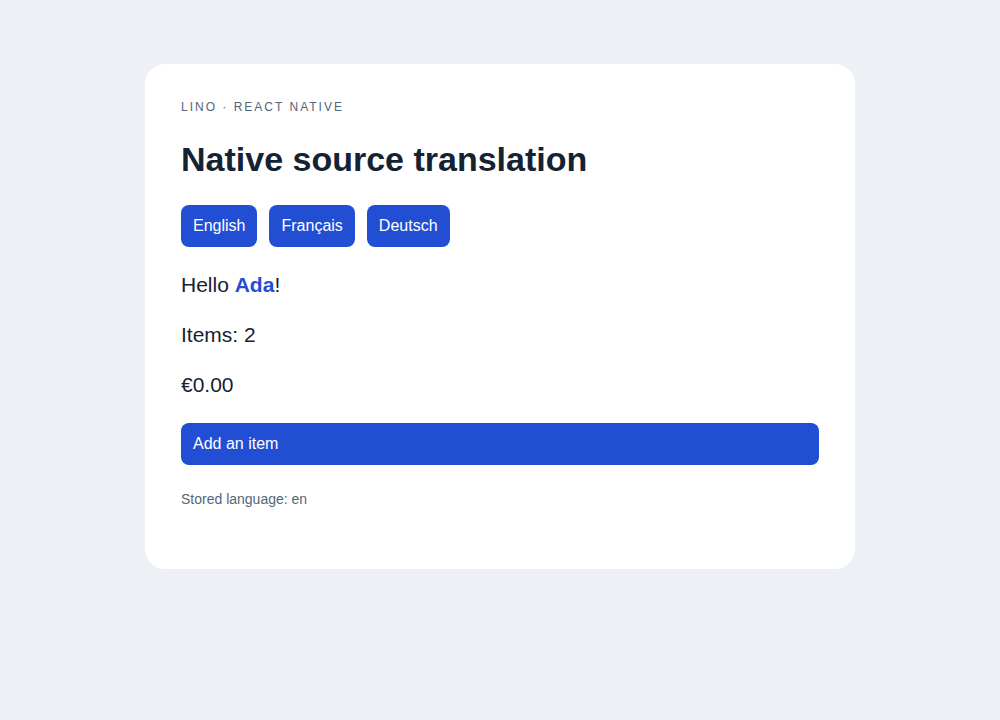
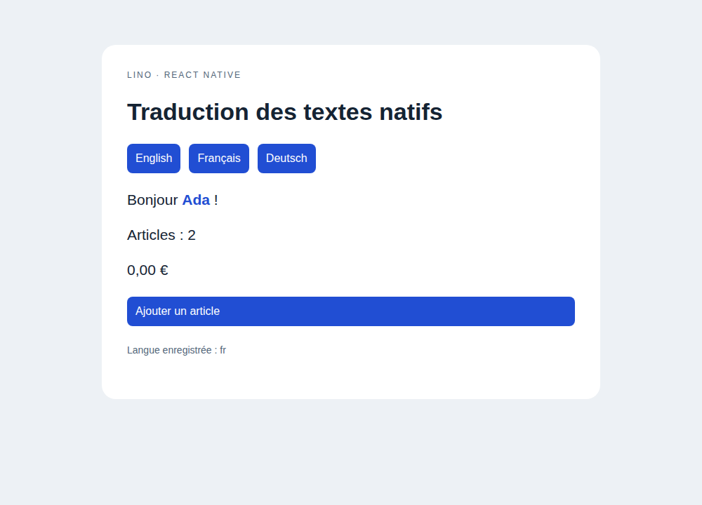

# React Native source messages

The optional `lino-i18n/react-native` entry uses React and the application's own
`Text` component. It imports no native platform module, HTML select or storage
backend. It works with React Native and React Native Web component identities.

```tsx
import { Text, View } from "react-native";
import AsyncStorage from "@react-native-async-storage/async-storage";
import { createNativeI18n, Var } from "lino-i18n/react-native";

const native = createNativeI18n({
  Text,
  sourceLocale: "en",
  locales: { fr: { "Hello <c0>{name}</c0>!": "Bonjour <c0>{name}</c0> !" } },
  storage: AsyncStorage,
});
await native.initialize();

export function App() {
  return (
    <native.Provider>
      <View>
        <native.T textProps={{ style: { fontSize: 18 } }}>
          Hello <Text style={{ fontWeight: "bold" }}><Var name="name">Ada</Var></Text>!
        </native.T>
        <native.Currency value={0} currency="EUR" />
      </View>
    </native.Provider>
  );
}
```

`T` and all formatters wrap their output in the supplied `Text`. `textProps`
retains that component's types. Nested `Text` children are structural rich
content: translations reorder their text while code retains props, styles,
refs and handlers. Custom components remain opaque; `richComponents` explicitly
opts a custom text component into traversal. Keep children valid for native
text layout, as described in the [React Native Text documentation](https://reactnative.dev/docs/text).
Use `Var` for named runtime values and opaque text components.

The factory exposes `Provider`, `T`, `Var`, `Static`, `Derive`, `Branch`,
`Plural`, `Num`, `Currency`, `DateTime`, `RelativeTime`, `RelativeDate` and
`List`. Formatters retain the [React formatter props](source-messages.md),
including the explicit `now` required for relative dates. Shared React hooks
are exported directly. `useLocaleSelector()` supplies locale choices, direction
and an async setter; `useRegionSelector()` supplies region state and setters.
Build controls with the application's native pressable or picker components.

`initialize()` reads a stored locale, preloads its catalog, deduplicates concurrent
initializations and can retry failures. A later user choice supersedes stored
state. `switchLocale()` loads and persists the latest successful choice; writes
already in flight are serialized so an older choice cannot finish last. Source
locale selection needs no catalog. `storageKey` defaults to `lino-locale`.
Without `storage`, no persistence is attempted. Callers receive read/write/load
errors; a failed write does not roll back an already rendered locale.

Provide `loadCatalog`, versioned cache options or an existing `{ i18n }` as in
the core API. `native.i18n.gt` also supports code-only messages. Create a separate
factory per SSR request; the browser example uses React Native Web's actual
[Text implementation](https://necolas.github.io/react-native-web/docs/text/).

## Extraction and validation

The normal JS/TS/JSX extractor recognizes `createNativeI18n`, destructured or
namespaced `T`, and aliased/namespaced `Text` imports from `react-native` and
`react-native-web`. Its manifest matches the runtime's rich source identity.
Custom structural components need an explicit source; unresolved dynamic rich
children diagnose rather than silently emit a different identity.

Eight runtime tests use React Native Web 0.21.4. Two Chromium tests verify
native press handlers, zero-value formatting, persistence across reloads,
failed loads and nested styles. The strict type suite checks injected component
prop inference. An optional [type probe](../js/experiments/native-types/README.md)
also passed against actual React Native 0.87.1. No device or emulator run was
available, and this evidence does not prove native layout/platform behavior.

The runtime requires `Intl` locale, plural, number, date, relative-time and list
support. On an older Hermes engine, supply the corresponding
[FormatJS polyfills](https://formatjs.github.io/docs/react-intl/#runtime-requirements)
before importing the adapter. Automatic polyfill/locale-data installation,
GT's native bridge and platform locale discovery are outside this adapter.




