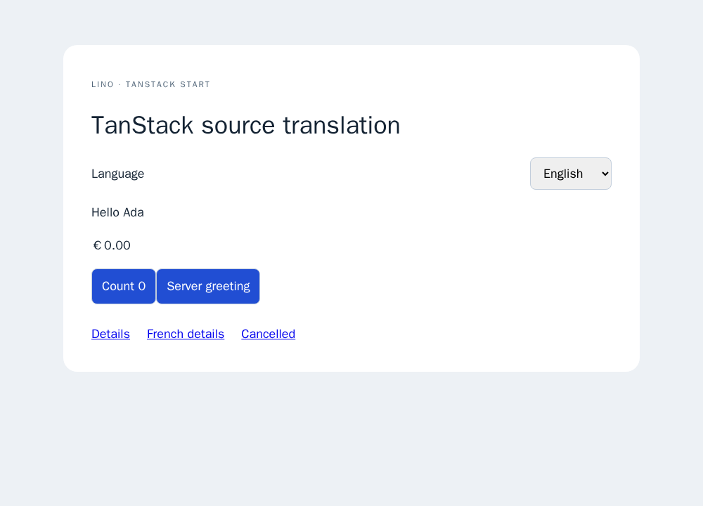
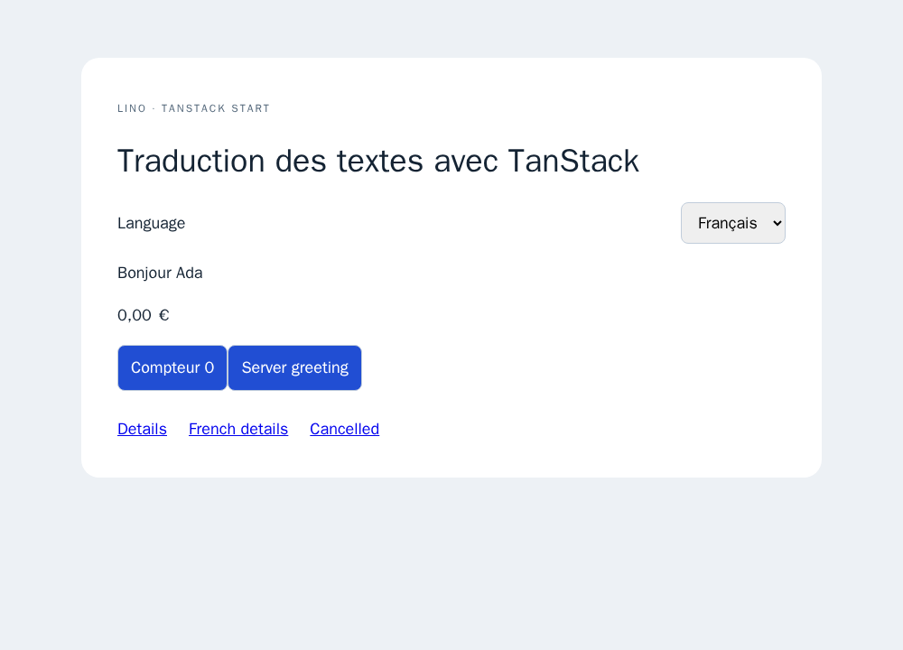

# TanStack Start

The optional `lino-i18n/tanstack-start/server` and `/client` entries support
React Start 1.168 and Router 1.170. Install the framework separately; the core
and native browser entries do not import it. The fixture uses Start 1.168.60,
Router 1.170.41 and Vite 8.3.4.

## Request middleware and server functions

Create one adapter in server-only code. Each middleware invocation creates an
independent translator, exposes it as `context.lino`, and scopes the ambient
accessors across route loaders, nested middleware and server functions.

```js
// i18n.js
import { createServerOnlyFn } from "@tanstack/react-start";
import { createTanStackI18n } from "lino-i18n/tanstack-start/server";

let translation;
export const getTranslation = createServerOnlyFn(
  () =>
    (translation ||= createTanStackI18n({
      sourceLocale: "en",
      supportedLanguages: ["en", "fr"],
      localeConfig: { locales: ["en", "fr"] },
      locales: { fr: { Hello: "Bonjour" } },
    })),
);
```

```js
// start.js
import {
  createStart,
  createIsomorphicFn,
  createCsrfMiddleware,
} from "@tanstack/react-start";
import { getTranslation } from "./i18n.js";

export const startInstance = createStart(
  createIsomorphicFn()
    .server(() => ({
      requestMiddleware: [
        createCsrfMiddleware({
          filter: (ctx) => ctx.handlerType === "serverFn",
        }),
        getTranslation().middleware,
      ],
    }))
    .client(() => ({})),
);
```

```js
import { createServerFn } from "@tanstack/react-start";
import { msg } from "lino-i18n/messages";
import { getTranslation } from "./i18n.js";

const hello = msg("Hello");
export const greeting = createServerFn({ method: "GET" }).handler(() =>
  getTranslation().getGT()(hello),
);
export const snapshot = createServerFn({ method: "GET" })
  .validator((locale) => {
    if (!["en", "fr"].includes(locale)) throw new Error("Unsupported locale");
    return locale;
  })
  .handler(({ data }) => getTranslation().loadSnapshot(data));
```

Start compiles `createServerOnlyFn` and `createIsomorphicFn` boundaries. Keeping
the adapter initialization inside these boundaries prevents Node's
AsyncLocalStorage from entering the browser graph. See the official
[execution patterns](https://tanstack.com/start/latest/docs/framework/react/guide/code-execution-patterns),
[middleware](https://tanstack.com/start/latest/docs/framework/react/guide/middleware)
and [server functions](https://tanstack.com/start/latest/docs/framework/react/guide/server-functions).

The server adapter exposes the Node context's `getGT`, `getMessages`,
`getTranslations`, `getTranslator`, `getLocale`, locale properties and version
accessors, plus `getSnapshot`, `getEnabled` and `loadSnapshot(locale)`. Access
outside an active request throws. `loadSnapshot` validates configured locales
and builds an independent snapshot when preloading another locale. It leaves
the active request unchanged. Source-locale requests skip catalog downloads.
Request locale precedence is explicit locale, URL prefix, cookie, then accepted
languages, using the existing Web request helpers.

## Hydration and navigation

Use the snapshot server function in the `/$locale` route loader, validate the
route parameter, then wrap its outlet:

```jsx
import {
  TanStackI18nProvider,
  LocaleSelector,
  LocaleLink,
  T,
  Var,
} from "lino-i18n/tanstack-start/client";

function Layout() {
  const { snapshot } = Route.useLoaderData();
  return (
    <TanStackI18nProvider snapshot={snapshot}>
      <Outlet />
    </TanStackI18nProvider>
  );
}
function Content() {
  return (
    <>
      <T>
        Hello <Var name="name">Ada</Var>
      </T>
      <LocaleSelector
        aria-label="Language"
        labels={{ en: "English", fr: "Français" }}
      />
      <LocaleLink to="/details" search={{ from: "home" }} hash="content">
        Details
      </LocaleLink>
    </>
  );
}
```

The client entry reexports the React components, formatters and hooks. Its
`useSetLocale` also navigates through Router and retains query/hash values.
`LocaleLink` wraps the actual Router Link, localizes absolute site paths and
keeps click handlers, preloading and Router props. External and relative links
retain Router behavior. The default cookie is `locale`; configure the provider
and server with the same `cookieName`. A resolved locale link writes the cookie;
preloading and cancelled clicks leave the preference unchanged. Selector errors
reach `onError` (default `console.error`). Applications own the document's lang
attribute; the example derives it from locale route loader data.

## Example and verification

From `js/`:

```sh
npm run build:tanstack
LINO_TANSTACK_PRODUCTION=1 npm run test:tanstack
node node_modules/srvx/bin/srvx.mjs serve --prod --entry examples/tanstack-usage/dist/server/server.js --static ../client --host 127.0.0.1 --port 4175
```

The build uses Start's real Vite plugin. The production fixture reuses
[srvx's Web-handler and static-file server](https://srvx.h3.dev/guide/cli).
Browser tests cover SSR, hydration, retained component state, query/hash links,
ambient server functions, cookies, preloading and cancelled navigation. Strict
TypeScript fixtures use the actual framework declarations. Direct factory
imports and client hooks participate in shared static extraction; server-only
wrapper calls should use explicit `msg` descriptors as shown above.

This adapter targets Node request contexts and locale path prefixes. Edge
deployment, domain/base-path routing, arbitrary router setups and compatibility
with GT's condition-store/wire encodings remain outside this fixture.




